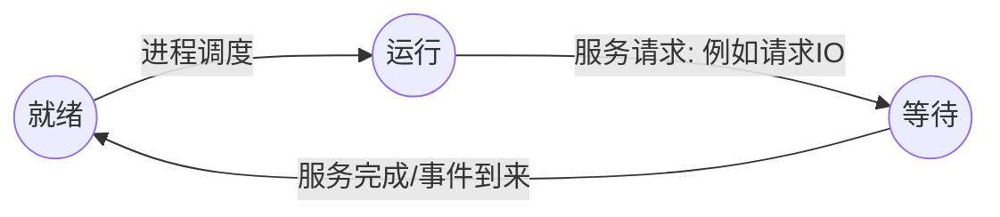

## 操作系统

### 绪论

分时技术，多道程序设计技术的出现标志这操作系统的形成

**操作系统的特性:** 
1. 并发
2. 共享
3. 虚拟
4. 异步

**操作系统的基本类型** 
1. 批量操作系统
2. 分时操作系统
3. 实时操作系统
4. 个人计算机操作系统
5. 网络操作系统
6. 分布式操作系统

#### 中断

**按照种类分类中断** 
1. 输入输出中断
2. 外中断
3. 机器故障中断
4. 程序中断
5. 访管中断

**按照中断方式分类** 
1. 资源中断
2. 强迫性中断

**按照中断类型分类** 
1. 外中断
2. 内中断(俘获)

**向量中断和探寻中断** 
1. 向量中断: 中断源自己引导处理机进入中断服务程序的中断过程
2. 探寻中断: 中断响应转入某一大类中断处理程序入口(例如 io 出错 转入道 I/O 中断处理程序入口)

**软件中断的处理过程**
1. 保护现场和传递参数
2. 执行相应的中断(自陷)服务例程
3. 恢复现场和退出中断

#### 系统引导

**系统引导** 他的人任务是将操作系统必要部分装入主存并使系统运行

**系统引导的方式** 
1. 独立引导(滚雪球方式)
2. 辅助下装

#### 用户接口

**定义:**  操作系统的用户接口是操作系统提供给用户与计算机打交道的外部机制。 用户能够借助这种机制和系统提供的手段来控制操作系统

#### 系统调用
1. 系统调用就是用户在程序中调用操作系统提供的一些子功能  
2. 在任何操作系统中，系统调用是用户空间访问内核的唯一方法

### 进程及进程管理

**顺序程序特点** 
1. 顺序性
2. 封闭性(程序执行开始、计算结果不受外界因素干扰)
3. 可再现性

**并发进程特点** 
1. 失去程序封闭性
2. 程序与计算不再一一对应
3. 程序并发执行时候的相互制约关系

**进程的基本状态** 
1. 就绪状态
2. 运行状态
3. 等待状态

**进程基本状态变迁图** 

#### 进程控制块
概念: 描述一个进程和其他进程以及系统资源的关系，刻画一个进程各个不同时期所处在的状态，人们采用了一个与进程相联系的数据块，称为进程控制块

#### 进程之间的约束关系

